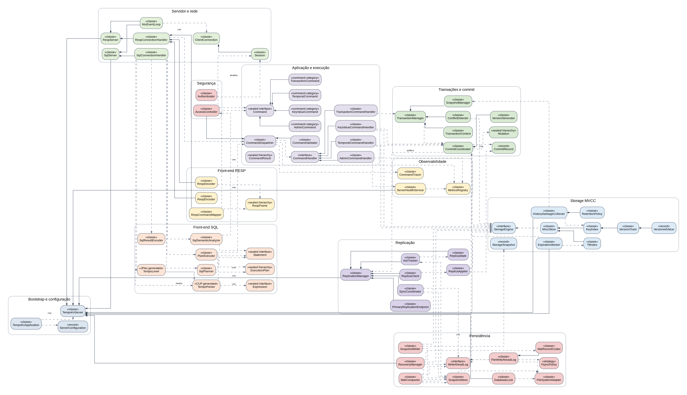

# TempoKV — Diagrama de Classes Conceitual

> Classes, responsabilidades e relações da arquitetura completa.

Legenda: losango = composição; seta vazia = herança/implementação; linha tracejada = dependência, criação ou publicação.

# 1. Decisões arquiteturais

| **Forma do produto** | Servidor Java single-node no primeiro marco; replicação primário-réplica no marco final.                                                         |
|----------------------|--------------------------------------------------------------------------------------------------------------------------------------------------|
| **Distribuição**     | JAR executável e imagem Docker; dados persistentes montados em /data.                                                                            |
| **Arquitetura**      | Monólito modular com Ports and Adapters. Protocolos são adapters; Command/handlers formam a aplicação; StorageEngine e WriteAheadLog são portas. |
| **Rede**             | Java NIO sem Spring Boot ou Netty no núcleo inicial.                                                                                             |
| **SQL**              | Lexer JFlex e parser Java CUP; AST e ExecutionPlan próprios.                                                                                     |
| **Persistência**     | WAL binário, snapshots atômicos, recuperação e compactação.                                                                                      |
| **Regra central**    | Toda escrita local passa por CommitCoordinator; réplica aplica CommitRecord sem gerar versão.                                                    |

> Nota de leitura
> O diagrama é conceitual: categorias como KeyValueCommand representam uma família selada de records concretos. DTOs triviais e exceções específicas não são exibidos para preservar legibilidade.

# 2. Responsabilidades por classe

## Bootstrap e configuração

| **Classe**          | **Tipo** | **Responsabilidade**                                                                                                      | **Etapa**                | **Casos de uso**    |
|---------------------|----------|---------------------------------------------------------------------------------------------------------------------------|--------------------------|---------------------|
| TempoKvApplication  | classe   | Ponto de entrada do processo. Carrega configuração, monta o grafo de componentes e inicia o ciclo de vida do nó.          | E1; altera em E8         | UC-00, UC-01        |
| ServerConfiguration | record   | Modelo imutável das opções do nó: portas, diretório de dados, papel primário/réplica, retenção, persistência e segurança. | E1; altera em E5, E7, E8 | UC-00, UC-01, UC-13 |
| TempoKvServer       | classe   | Orquestra inicialização, recuperação, endpoints, workers e encerramento ordenado de uma instância TempoKV.                | E1; altera em E5, E8     | UC-00, UC-01, UC-13 |

## Servidor e rede

| **Classe**            | **Tipo** | **Responsabilidade**                                                                                        | **Etapa**            | **Casos de uso**                                                     |
|-----------------------|----------|-------------------------------------------------------------------------------------------------------------|----------------------|----------------------------------------------------------------------|
| RespServer            | classe   | Endpoint TCP compatível com RESP. Aceita conexões Redis e delega cada sessão ao handler apropriado.         | E2; altera em E8     | UC-02, UC-03, UC-05, UC-06, UC-07, UC-08, UC-09, UC-12, UC-13        |
| SqlServer             | classe   | Endpoint TCP textual dedicado ao SQL temporal e administrativo.                                             | E6; altera em E8     | UC-04, UC-05, UC-06, UC-07, UC-08, UC-12, UC-13                      |
| NioEventLoop          | classe   | Gerencia sockets não bloqueantes, leitura parcial, escrita pendente e backpressure para múltiplos clientes. | E2; altera em E6, E8 | UC-02, UC-03, UC-04, UC-05, UC-06, UC-07, UC-08, UC-09, UC-12, UC-13 |
| ClientConnection      | classe   | Representa uma conexão ativa, seus buffers e o vínculo com a sessão lógica do cliente.                      | E2; altera em E6     | UC-02, UC-03, UC-04, UC-08, UC-09, UC-12                             |
| Session               | classe   | Mantém identidade autenticada, estado transacional e contexto de execução associado a uma conexão.          | E2; altera em E7     | UC-02, UC-03, UC-04, UC-08, UC-09, UC-12                             |
| RespConnectionHandler | classe   | Coordena decodificação RESP, mapeamento de comando, despacho e codificação da resposta para uma conexão.    | E2; altera em E7     | UC-02, UC-03, UC-05, UC-06, UC-07, UC-08, UC-09, UC-12               |
| SqlConnectionHandler  | classe   | Coordena compilação SQL, execução do plano e serialização tabular da resposta.                              | E6; altera em E7     | UC-04, UC-05, UC-06, UC-07, UC-08, UC-12                             |

## Front-end RESP

| **Classe**        | **Tipo**         | **Responsabilidade**                                                                                      | **Etapa**                | **Casos de uso**                                       |
|-------------------|------------------|-----------------------------------------------------------------------------------------------------------|--------------------------|--------------------------------------------------------|
| RespDecoder       | classe           | Converte bytes RESP parciais ou completos em uma árvore de frames sem interpretar a semântica do comando. | E2                       | UC-02, UC-03, UC-05, UC-06, UC-07, UC-08, UC-09, UC-12 |
| RespEncoder       | classe           | Converte resultados internos em respostas RESP válidas, incluindo erros e respostas em pipeline.          | E2                       | UC-02, UC-03, UC-05, UC-06, UC-07, UC-08, UC-09, UC-12 |
| RespFrame         | sealed hierarchy | Modelo conceitual dos tipos RESP decodificados: arrays, strings, inteiros, nulos e erros.                 | E2                       | UC-02, UC-03, UC-05, UC-06, UC-07, UC-08, UC-09, UC-12 |
| RespCommandMapper | classe           | Traduz um frame RESP de requisição para uma categoria de comando interno tipada.                          | E2; altera em E3, E4, E7 | UC-02, UC-03, UC-05, UC-06, UC-07, UC-08, UC-09, UC-12 |

## Front-end SQL

| **Classe**          | **Tipo**         | **Responsabilidade**                                                                                           | **Etapa**        | **Casos de uso**                         |
|---------------------|------------------|----------------------------------------------------------------------------------------------------------------|------------------|------------------------------------------|
| TempoLexer          | JFlex generated  | Lexer gerado por JFlex. Converte texto SQL em tokens com posição, linha e coluna.                              | E6               | UC-04, UC-05, UC-06, UC-07, UC-08, UC-12 |
| TempoParser         | CUP generated    | Parser gerado por Java CUP. Constrói a AST a partir dos tokens emitidos pelo lexer.                            | E6               | UC-04, UC-05, UC-06, UC-07, UC-08, UC-12 |
| Statement           | sealed interface | Raiz conceitual das instruções SQL aceitas pelo produto, como SELECT, UPSERT e controle transacional.          | E6               | UC-04, UC-05, UC-06, UC-07, UC-08, UC-12 |
| Expression          | sealed interface | Raiz das expressões da AST: literais, referências, predicados e funções temporais.                             | E6               | UC-04, UC-05, UC-06, UC-07, UC-12        |
| SqlSemanticAnalyzer | classe           | Valida nomes, tipos, funções, cláusulas temporais e permissões sem executar a consulta.                        | E6; altera em E7 | UC-04, UC-05, UC-06, UC-07, UC-08, UC-12 |
| SqlPlanner          | classe           | Transforma uma AST validada em um plano lógico orientado às capacidades key-value e temporais do storage.      | E6               | UC-04, UC-05, UC-06, UC-07, UC-08, UC-12 |
| ExecutionPlan       | sealed hierarchy | Representa operações lógicas como point lookup, historical lookup, filter, projection, sort, limit e mutation. | E6               | UC-04, UC-05, UC-06, UC-07, UC-08, UC-12 |
| PlanExecutor        | classe           | Executa o plano SQL usando o mesmo dispatcher e os mesmos handlers utilizados pela interface RESP.             | E6; altera em E7 | UC-04, UC-05, UC-06, UC-07, UC-08, UC-12 |
| SqlResultEncoder    | classe           | Serializa resultados internos em formato tabular textual e, opcionalmente, JSON administrativo.                | E6               | UC-04, UC-05, UC-06, UC-07, UC-08, UC-12 |

## Aplicação e execução

| **Classe**                | **Tipo**         | **Responsabilidade**                                                                  | **Etapa**                    | **Casos de uso**                                              |
|---------------------------|------------------|---------------------------------------------------------------------------------------|------------------------------|---------------------------------------------------------------|
| Command                   | sealed interface | Contrato comum das solicitações internas, independente do protocolo que as originou.  | E2; altera em E3, E4, E7     | UC-02, UC-03, UC-04, UC-05, UC-06, UC-07, UC-08, UC-09, UC-12 |
| AdminCommand              | command category | Categoria de comandos operacionais, incluindo PING, INFO e HEALTH.                    | E2; altera em E7             | UC-02, UC-12                                                  |
| KeyValueCommand           | command category | Categoria de operações sobre o estado atual: GET, SET, DEL, EXPIRE e TTL.             | E3                           | UC-03, UC-04, UC-10                                           |
| TemporalCommand           | command category | Categoria de operações históricas: GETAT, HISTORY, DIFF e RESTOREAT.                  | E4                           | UC-05, UC-06, UC-07                                           |
| TransactionCommand        | command category | Categoria de controle transacional: BEGIN, COMMIT e ROLLBACK.                         | E7                           | UC-08, UC-09                                                  |
| CommandDispatcher         | classe           | Aplica o pipeline comum e encaminha cada comando ao handler correspondente.           | E2; altera em E3, E4, E7     | UC-02, UC-03, UC-04, UC-05, UC-06, UC-07, UC-08, UC-09, UC-12 |
| CommandHandler            | interface        | Contrato dos handlers especializados que executam categorias de comandos internos.    | E2; altera em E3, E4, E7     | UC-02, UC-03, UC-04, UC-05, UC-06, UC-07, UC-08, UC-09, UC-12 |
| AdminCommandHandler       | classe           | Executa PING e, posteriormente, consolida informações de saúde e métricas.            | E2; altera em E7             | UC-02, UC-12                                                  |
| KeyValueCommandHandler    | classe           | Executa leituras atuais e transforma mutações key-value em commits versionados.       | E3; altera em E7             | UC-03, UC-04, UC-10                                           |
| TemporalCommandHandler    | classe           | Executa consultas históricas, comparações e restauração por meio do storage MVCC.     | E4; altera em E7             | UC-05, UC-06, UC-07                                           |
| TransactionCommandHandler | classe           | Conecta os comandos transacionais ao TransactionManager e ao contexto da sessão.      | E7                           | UC-08, UC-09                                                  |
| CommandValidator          | classe           | Valida argumentos, limites, estado da sessão e regras operacionais antes da execução. | E2; altera em E3, E4, E7     | UC-02, UC-03, UC-04, UC-05, UC-06, UC-07, UC-08, UC-09, UC-12 |
| CommandResult             | sealed hierarchy | Resultado neutro de execução, posteriormente adaptado para RESP ou SQL.               | E2; altera em E3, E4, E6, E7 | UC-02, UC-03, UC-04, UC-05, UC-06, UC-07, UC-08, UC-09, UC-12 |

## Segurança

| **Classe**       | **Tipo** | **Responsabilidade**                                                                                                         | **Etapa**        | **Casos de uso**                                              |
|------------------|----------|------------------------------------------------------------------------------------------------------------------------------|------------------|---------------------------------------------------------------|
| Authenticator    | classe   | Resolve a identidade da sessão a partir das credenciais do protocolo; começa permissivo e é endurecido na etapa operacional. | E2; altera em E7 | UC-02, UC-03, UC-04, UC-05, UC-06, UC-07, UC-08, UC-09, UC-12 |
| AccessController | classe   | Autoriza comandos e escopos de chave para a identidade associada à sessão.                                                   | E2; altera em E7 | UC-02, UC-03, UC-04, UC-05, UC-06, UC-07, UC-08, UC-09, UC-12 |

## Transações e commit

| **Classe**         | **Tipo**         | **Responsabilidade**                                                                    | **Etapa**                | **Casos de uso**                                |
|--------------------|------------------|-----------------------------------------------------------------------------------------|--------------------------|-------------------------------------------------|
| TransactionManager | classe           | Controla abertura, commit, rollback e transição de estado das transações de uma sessão. | E7                       | UC-08, UC-09                                    |
| TransactionContext | classe           | Mantém snapshot, write set e estado de uma transação ativa.                             | E7                       | UC-08, UC-09                                    |
| SnapshotManager    | classe           | Registra snapshots ativos e define a versão máxima visível para leituras consistentes.  | E7                       | UC-08, UC-09, UC-11                             |
| ConflictDetector   | classe           | Detecta conflitos de escrita comparando versões atuais com a versão do snapshot.        | E7                       | UC-09                                           |
| CommitCoordinator  | classe           | Coordena versão, WAL, aplicação atômica no storage e publicação para replicação.        | E3; altera em E5, E7, E8 | UC-03, UC-04, UC-07, UC-08, UC-09, UC-10, UC-13 |
| VersionGenerator   | classe           | Gera identificadores de commit monotônicos dentro de um nó primário.                    | E3; altera em E8         | UC-03, UC-04, UC-07, UC-08, UC-10, UC-13        |
| Mutation           | sealed hierarchy | Representa uma alteração imutável a ser confirmada: put, tombstone, TTL ou metadado.    | E3; altera em E4, E5     | UC-03, UC-04, UC-07, UC-08, UC-10, UC-13        |
| CommitRecord       | record           | Agrupa uma versão, metadados e uma lista ordenada de mutações atômicas.                 | E3; altera em E5, E8     | UC-03, UC-04, UC-07, UC-08, UC-10, UC-13        |

## Storage MVCC

| **Classe**              | **Tipo**  | **Responsabilidade**                                                                                            | **Etapa**                    | **Casos de uso**                                                     |
|-------------------------|-----------|-----------------------------------------------------------------------------------------------------------------|------------------------------|----------------------------------------------------------------------|
| StorageEngine           | interface | Porta de armazenamento usada pela aplicação para leituras atuais, históricas, aplicação de commits e snapshots. | E3; altera em E4, E5, E7, E8 | UC-01, UC-03, UC-04, UC-05, UC-06, UC-07, UC-08, UC-10, UC-11, UC-13 |
| MvccStore               | classe    | Implementação em memória do StorageEngine baseada em cadeias imutáveis de versões.                              | E3; altera em E4, E5, E7, E8 | UC-01, UC-03, UC-04, UC-05, UC-06, UC-07, UC-08, UC-10, UC-11, UC-13 |
| KeyIndex                | classe    | Índice primário que associa cada chave à sua cadeia de versões.                                                 | E3; altera em E4, E5         | UC-01, UC-03, UC-04, UC-05, UC-06, UC-07, UC-08, UC-10, UC-11, UC-13 |
| VersionChain            | classe    | Mantém as versões imutáveis de uma chave e resolve visibilidade por versão ou timestamp.                        | E3; altera em E4, E5, E7     | UC-01, UC-03, UC-04, UC-05, UC-06, UC-07, UC-08, UC-10, UC-11, UC-13 |
| VersionedValue          | record    | Representa uma versão imutável, com valor ou tombstone, timestamp, TTL e metadados de commit.                   | E3; altera em E4, E5         | UC-01, UC-03, UC-04, UC-05, UC-06, UC-07, UC-08, UC-10, UC-11, UC-13 |
| TtlIndex                | classe    | Índice ordenado dos próximos vencimentos, separado do índice principal de chaves.                               | E3; altera em E5             | UC-01, UC-03, UC-10, UC-11                                           |
| ExpirationWorker        | classe    | Consome vencimentos do TtlIndex e solicita tombstones versionados ao CommitCoordinator.                         | E5                           | UC-00, UC-10                                                         |
| RetentionPolicy         | classe    | Define quantas versões e por quanto tempo o histórico deve ser preservado por padrão ou prefixo.                | E4; altera em E5             | UC-06, UC-11                                                         |
| HistoryGarbageCollector | classe    | Remove versões fora da retenção sem invalidar snapshots ativos.                                                 | E4; altera em E5, E7         | UC-00, UC-06, UC-11                                                  |
| StorageSnapshot         | record    | Representação consistente e serializável do estado retido em uma versão de corte.                               | E5                           | UC-01, UC-11, UC-13                                                  |

## Persistência

| **Classe**        | **Tipo**  | **Responsabilidade**                                                                          | **Etapa**            | **Casos de uso**                                       |
|-------------------|-----------|-----------------------------------------------------------------------------------------------|----------------------|--------------------------------------------------------|
| WriteAheadLog     | interface | Porta de append, sync e replay de commits duráveis.                                           | E5; altera em E8     | UC-01, UC-03, UC-04, UC-07, UC-08, UC-10, UC-11, UC-13 |
| FileWriteAheadLog | classe    | Implementação segmentada em arquivos do WriteAheadLog.                                        | E5; altera em E8     | UC-01, UC-03, UC-04, UC-07, UC-08, UC-10, UC-11, UC-13 |
| WalRecordCodec    | classe    | Codifica e decodifica registros binários autodelimitados do WAL.                              | E5; altera em E8     | UC-01, UC-03, UC-04, UC-07, UC-08, UC-10, UC-11, UC-13 |
| FsyncPolicy       | strategy  | Define quando commits gravados são sincronizados no dispositivo.                              | E5                   | UC-03, UC-04, UC-07, UC-08, UC-10, UC-11               |
| SnapshotStore     | classe    | Persiste e carrega snapshots validados e seus metadados de versão.                            | E5; altera em E8     | UC-01, UC-11, UC-13                                    |
| SnapshotWriter    | classe    | Captura um StorageSnapshot consistente e o publica de forma atômica.                          | E5                   | UC-11                                                  |
| WalCompactor      | classe    | Descarta segmentos do WAL cobertos por snapshot durável e pelas necessidades de replicação.   | E5; altera em E8     | UC-11, UC-13                                           |
| RecoveryManager   | classe    | Reconstrói o storage carregando snapshot e reaplicando commits válidos do WAL.                | E5; altera em E8     | UC-01, UC-13                                           |
| FileSystemAdapter | classe    | Centraliza operações de arquivo, rename atômico, locks, sync e simulação de falhas em testes. | E1; altera em E5, E8 | UC-00, UC-01, UC-11, UC-13                             |
| DatabaseLock      | classe    | Mantém lock exclusivo sobre o diretório de dados de uma instância.                            | E1                   | UC-00, UC-01                                           |

## Observabilidade

| **Classe**          | **Tipo** | **Responsabilidade**                                                                       | **Etapa**                            | **Casos de uso**                                                                          |
|---------------------|----------|--------------------------------------------------------------------------------------------|--------------------------------------|-------------------------------------------------------------------------------------------|
| MetricsRegistry     | classe   | Agrega contadores, latências, tamanhos e estados usados pelos comandos administrativos.    | E1; altera em E2, E3, E5, E6, E7, E8 | UC-00, UC-02, UC-03, UC-04, UC-05, UC-06, UC-07, UC-08, UC-09, UC-10, UC-11, UC-12, UC-13 |
| CommandTracer       | classe   | Registra o caminho e os tempos de cada comando sem expor valores sensíveis.                | E7                                   | UC-03, UC-04, UC-05, UC-06, UC-07, UC-08, UC-09, UC-12, UC-13                             |
| ServerHealthService | classe   | Calcula estados STARTING, RECOVERING, READY, DEGRADED e STOPPING a partir dos subsistemas. | E1; altera em E5, E7, E8             | UC-00, UC-01, UC-12, UC-13                                                                |

## Replicação

| **Classe**                 | **Tipo** | **Responsabilidade**                                                                     | **Etapa** | **Casos de uso** |
|----------------------------|----------|------------------------------------------------------------------------------------------|-----------|------------------|
| ReplicationManager         | classe   | Orquestra o modo primário ou réplica e integra commits, sincronização e ACKs.            | E8        | UC-00, UC-13     |
| PrimaryReplicationEndpoint | classe   | Aceita réplicas, autentica o handshake e transmite snapshot ou commits incrementais.     | E8        | UC-13            |
| ReplicaClient              | classe   | Mantém a conexão de uma réplica com o primário e recebe o fluxo ordenado.                | E8        | UC-13            |
| ReplicaApplier             | classe   | Valida e aplica localmente snapshots e CommitRecords recebidos, sem gerar novas versões. | E8        | UC-13            |
| ReplicaState               | classe   | Mantém papel, versão aplicada, versão confirmada e estado de sincronização do nó.        | E8        | UC-13            |
| AckTracker                 | classe   | Rastreia a versão confirmada por cada réplica e suporta decisões de compactação.         | E8        | UC-13            |
| SyncCoordinator            | classe   | Escolhe entre sincronização completa por snapshot e sincronização incremental por WAL.   | E8        | UC-13            |

# 3. Regras de relacionamento

| **Regra**                          | **Consequência**                                                                                          |
|------------------------------------|-----------------------------------------------------------------------------------------------------------|
| Protocolos não acessam o storage   | RespConnectionHandler e SqlConnectionHandler terminam no CommandDispatcher/PlanExecutor.                  |
| SQL não é um segundo motor         | PlanExecutor reutiliza comandos e handlers; ExecutionPlan apenas compõe operações.                        |
| Escritas locais têm um único funil | KeyValueCommandHandler, TemporalCommandHandler e TransactionManager enviam Mutation ao CommitCoordinator. |
| Durabilidade precede publicação    | CommitCoordinator usa WriteAheadLog antes de StorageEngine, conforme FsyncPolicy.                         |
| MVCC é interno ao storage          | KeyIndex localiza VersionChain; VersionChain contém VersionedValue imutável.                              |
| Recuperação é anterior à rede      | RecoveryManager termina antes de RespServer/SqlServer aceitarem tráfego.                                  |
| Réplica não gera versão            | ReplicaApplier aplica CommitRecord recebido diretamente ao StorageEngine.                                 |
| Observabilidade é transversal      | MetricsRegistry e CommandTracer observam o fluxo sem decidir regras de negócio.                           |

# 4. Matriz classe → etapa → casos de uso

| **Classe**                 | **Módulo**               | **Criada** | **Alterada**           | **Casos de uso**                                                                          |
|----------------------------|--------------------------|------------|------------------------|-------------------------------------------------------------------------------------------|
| TempoKvApplication         | Bootstrap e configuração | E1         | E8                     | UC-00, UC-01                                                                              |
| ServerConfiguration        | Bootstrap e configuração | E1         | E5, E7, E8             | UC-00, UC-01, UC-13                                                                       |
| TempoKvServer              | Bootstrap e configuração | E1         | E5, E8                 | UC-00, UC-01, UC-13                                                                       |
| RespServer                 | Servidor e rede          | E2         | E8                     | UC-02, UC-03, UC-05, UC-06, UC-07, UC-08, UC-09, UC-12, UC-13                             |
| SqlServer                  | Servidor e rede          | E6         | E8                     | UC-04, UC-05, UC-06, UC-07, UC-08, UC-12, UC-13                                           |
| NioEventLoop               | Servidor e rede          | E2         | E6, E8                 | UC-02, UC-03, UC-04, UC-05, UC-06, UC-07, UC-08, UC-09, UC-12, UC-13                      |
| ClientConnection           | Servidor e rede          | E2         | E6                     | UC-02, UC-03, UC-04, UC-08, UC-09, UC-12                                                  |
| Session                    | Servidor e rede          | E2         | E7                     | UC-02, UC-03, UC-04, UC-08, UC-09, UC-12                                                  |
| RespConnectionHandler      | Servidor e rede          | E2         | E7                     | UC-02, UC-03, UC-05, UC-06, UC-07, UC-08, UC-09, UC-12                                    |
| SqlConnectionHandler       | Servidor e rede          | E6         | E7                     | UC-04, UC-05, UC-06, UC-07, UC-08, UC-12                                                  |
| RespDecoder                | Front-end RESP           | E2         | —                      | UC-02, UC-03, UC-05, UC-06, UC-07, UC-08, UC-09, UC-12                                    |
| RespEncoder                | Front-end RESP           | E2         | —                      | UC-02, UC-03, UC-05, UC-06, UC-07, UC-08, UC-09, UC-12                                    |
| RespFrame                  | Front-end RESP           | E2         | —                      | UC-02, UC-03, UC-05, UC-06, UC-07, UC-08, UC-09, UC-12                                    |
| RespCommandMapper          | Front-end RESP           | E2         | E3, E4, E7             | UC-02, UC-03, UC-05, UC-06, UC-07, UC-08, UC-09, UC-12                                    |
| TempoLexer                 | Front-end SQL            | E6         | —                      | UC-04, UC-05, UC-06, UC-07, UC-08, UC-12                                                  |
| TempoParser                | Front-end SQL            | E6         | —                      | UC-04, UC-05, UC-06, UC-07, UC-08, UC-12                                                  |
| Statement                  | Front-end SQL            | E6         | —                      | UC-04, UC-05, UC-06, UC-07, UC-08, UC-12                                                  |
| Expression                 | Front-end SQL            | E6         | —                      | UC-04, UC-05, UC-06, UC-07, UC-12                                                         |
| SqlSemanticAnalyzer        | Front-end SQL            | E6         | E7                     | UC-04, UC-05, UC-06, UC-07, UC-08, UC-12                                                  |
| SqlPlanner                 | Front-end SQL            | E6         | —                      | UC-04, UC-05, UC-06, UC-07, UC-08, UC-12                                                  |
| ExecutionPlan              | Front-end SQL            | E6         | —                      | UC-04, UC-05, UC-06, UC-07, UC-08, UC-12                                                  |
| PlanExecutor               | Front-end SQL            | E6         | E7                     | UC-04, UC-05, UC-06, UC-07, UC-08, UC-12                                                  |
| SqlResultEncoder           | Front-end SQL            | E6         | —                      | UC-04, UC-05, UC-06, UC-07, UC-08, UC-12                                                  |
| Command                    | Aplicação e execução     | E2         | E3, E4, E7             | UC-02, UC-03, UC-04, UC-05, UC-06, UC-07, UC-08, UC-09, UC-12                             |
| AdminCommand               | Aplicação e execução     | E2         | E7                     | UC-02, UC-12                                                                              |
| KeyValueCommand            | Aplicação e execução     | E3         | —                      | UC-03, UC-04, UC-10                                                                       |
| TemporalCommand            | Aplicação e execução     | E4         | —                      | UC-05, UC-06, UC-07                                                                       |
| TransactionCommand         | Aplicação e execução     | E7         | —                      | UC-08, UC-09                                                                              |
| CommandDispatcher          | Aplicação e execução     | E2         | E3, E4, E7             | UC-02, UC-03, UC-04, UC-05, UC-06, UC-07, UC-08, UC-09, UC-12                             |
| CommandHandler             | Aplicação e execução     | E2         | E3, E4, E7             | UC-02, UC-03, UC-04, UC-05, UC-06, UC-07, UC-08, UC-09, UC-12                             |
| AdminCommandHandler        | Aplicação e execução     | E2         | E7                     | UC-02, UC-12                                                                              |
| KeyValueCommandHandler     | Aplicação e execução     | E3         | E7                     | UC-03, UC-04, UC-10                                                                       |
| TemporalCommandHandler     | Aplicação e execução     | E4         | E7                     | UC-05, UC-06, UC-07                                                                       |
| TransactionCommandHandler  | Aplicação e execução     | E7         | —                      | UC-08, UC-09                                                                              |
| CommandValidator           | Aplicação e execução     | E2         | E3, E4, E7             | UC-02, UC-03, UC-04, UC-05, UC-06, UC-07, UC-08, UC-09, UC-12                             |
| CommandResult              | Aplicação e execução     | E2         | E3, E4, E6, E7         | UC-02, UC-03, UC-04, UC-05, UC-06, UC-07, UC-08, UC-09, UC-12                             |
| Authenticator              | Segurança                | E2         | E7                     | UC-02, UC-03, UC-04, UC-05, UC-06, UC-07, UC-08, UC-09, UC-12                             |
| AccessController           | Segurança                | E2         | E7                     | UC-02, UC-03, UC-04, UC-05, UC-06, UC-07, UC-08, UC-09, UC-12                             |
| TransactionManager         | Transações e commit      | E7         | —                      | UC-08, UC-09                                                                              |
| TransactionContext         | Transações e commit      | E7         | —                      | UC-08, UC-09                                                                              |
| SnapshotManager            | Transações e commit      | E7         | —                      | UC-08, UC-09, UC-11                                                                       |
| ConflictDetector           | Transações e commit      | E7         | —                      | UC-09                                                                                     |
| CommitCoordinator          | Transações e commit      | E3         | E5, E7, E8             | UC-03, UC-04, UC-07, UC-08, UC-09, UC-10, UC-13                                           |
| VersionGenerator           | Transações e commit      | E3         | E8                     | UC-03, UC-04, UC-07, UC-08, UC-10, UC-13                                                  |
| Mutation                   | Transações e commit      | E3         | E4, E5                 | UC-03, UC-04, UC-07, UC-08, UC-10, UC-13                                                  |
| CommitRecord               | Transações e commit      | E3         | E5, E8                 | UC-03, UC-04, UC-07, UC-08, UC-10, UC-13                                                  |
| StorageEngine              | Storage MVCC             | E3         | E4, E5, E7, E8         | UC-01, UC-03, UC-04, UC-05, UC-06, UC-07, UC-08, UC-10, UC-11, UC-13                      |
| MvccStore                  | Storage MVCC             | E3         | E4, E5, E7, E8         | UC-01, UC-03, UC-04, UC-05, UC-06, UC-07, UC-08, UC-10, UC-11, UC-13                      |
| KeyIndex                   | Storage MVCC             | E3         | E4, E5                 | UC-01, UC-03, UC-04, UC-05, UC-06, UC-07, UC-08, UC-10, UC-11, UC-13                      |
| VersionChain               | Storage MVCC             | E3         | E4, E5, E7             | UC-01, UC-03, UC-04, UC-05, UC-06, UC-07, UC-08, UC-10, UC-11, UC-13                      |
| VersionedValue             | Storage MVCC             | E3         | E4, E5                 | UC-01, UC-03, UC-04, UC-05, UC-06, UC-07, UC-08, UC-10, UC-11, UC-13                      |
| TtlIndex                   | Storage MVCC             | E3         | E5                     | UC-01, UC-03, UC-10, UC-11                                                                |
| ExpirationWorker           | Storage MVCC             | E5         | —                      | UC-00, UC-10                                                                              |
| RetentionPolicy            | Storage MVCC             | E4         | E5                     | UC-06, UC-11                                                                              |
| HistoryGarbageCollector    | Storage MVCC             | E4         | E5, E7                 | UC-00, UC-06, UC-11                                                                       |
| StorageSnapshot            | Storage MVCC             | E5         | —                      | UC-01, UC-11, UC-13                                                                       |
| WriteAheadLog              | Persistência             | E5         | E8                     | UC-01, UC-03, UC-04, UC-07, UC-08, UC-10, UC-11, UC-13                                    |
| FileWriteAheadLog          | Persistência             | E5         | E8                     | UC-01, UC-03, UC-04, UC-07, UC-08, UC-10, UC-11, UC-13                                    |
| WalRecordCodec             | Persistência             | E5         | E8                     | UC-01, UC-03, UC-04, UC-07, UC-08, UC-10, UC-11, UC-13                                    |
| FsyncPolicy                | Persistência             | E5         | —                      | UC-03, UC-04, UC-07, UC-08, UC-10, UC-11                                                  |
| SnapshotStore              | Persistência             | E5         | E8                     | UC-01, UC-11, UC-13                                                                       |
| SnapshotWriter             | Persistência             | E5         | —                      | UC-11                                                                                     |
| WalCompactor               | Persistência             | E5         | E8                     | UC-11, UC-13                                                                              |
| RecoveryManager            | Persistência             | E5         | E8                     | UC-01, UC-13                                                                              |
| FileSystemAdapter          | Persistência             | E1         | E5, E8                 | UC-00, UC-01, UC-11, UC-13                                                                |
| DatabaseLock               | Persistência             | E1         | —                      | UC-00, UC-01                                                                              |
| MetricsRegistry            | Observabilidade          | E1         | E2, E3, E5, E6, E7, E8 | UC-00, UC-02, UC-03, UC-04, UC-05, UC-06, UC-07, UC-08, UC-09, UC-10, UC-11, UC-12, UC-13 |
| CommandTracer              | Observabilidade          | E7         | —                      | UC-03, UC-04, UC-05, UC-06, UC-07, UC-08, UC-09, UC-12, UC-13                             |
| ServerHealthService        | Observabilidade          | E1         | E5, E7, E8             | UC-00, UC-01, UC-12, UC-13                                                                |
| ReplicationManager         | Replicação               | E8         | —                      | UC-00, UC-13                                                                              |
| PrimaryReplicationEndpoint | Replicação               | E8         | —                      | UC-13                                                                                     |
| ReplicaClient              | Replicação               | E8         | —                      | UC-13                                                                                     |
| ReplicaApplier             | Replicação               | E8         | —                      | UC-13                                                                                     |
| ReplicaState               | Replicação               | E8         | —                      | UC-13                                                                                     |
| AckTracker                 | Replicação               | E8         | —                      | UC-13                                                                                     |
| SyncCoordinator            | Replicação               | E8         | —                      | UC-13                                                                                     |
