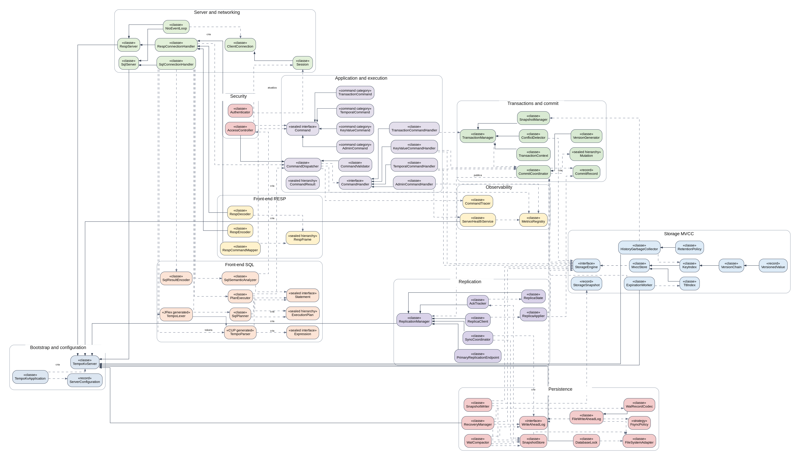

# TempoKV — Conceptual Class Diagram

> Classes, responsibilities and relationships of the complete architecture.

Caption: diamond = composition; empty arrow = inheritance/implementation; dashed line = dependency, creation or publication.

# 1. Architectural decisions

| **Product shape** | Java server with primary-replica replication.                                                         |
|----------------------|--------------------------------------------------------------------------------------------------------------------------------------------------|
| **Distribution** | Executable JAR and Docker image; persistent data mounted in /data.                                                                            |
| **Architecture** | Modular monolith with Ports and Adapters. Protocols are adapters; Command/handlers form the application; StorageEngine and WriteAheadLog are ports. |
| **Network** | Java NIO without Spring Boot or Netty in the initial core.                                                                                             |
| **SQL** | JFlex lexer and Java CUP parser; custom AST and ExecutionPlan.                                                                                  |
| **Persistence** | Binary WAL, atomic snapshots, recovery and compaction.                                                                                       |
| **Central rule** | All local writes go through CommitCoordinator; a replica applies CommitRecord without generating a version.                                                   |

> Reading Note
> The diagram is conceptual: categories like KeyValueCommand represent a sealed family of concrete records. Trivial DTOs and specific exceptions are not displayed to preserve readability.

# 2. Responsibilities by class

## Bootstrap and configuration

| **Class** | **Type** | **Responsibility** | **Use cases** |
|---------------------|----------|---------------------------------------------------------------------------------------------------------------------------|---------------------|
| TempoKvApplication | class | Process entry point. Loads configuration, assembles the component graph and starts the node life cycle.          | UC-00, UC-01 |
| ServerConfiguration | record | Immutable model of node options: ports, data directory, primary/replica role, retention, persistence, and security. | UC-00, UC-01, UC-13 |
| TempoKvServer | class | Orchestrates initialization, recovery, endpoints, workers, and orderly shutdown of a TempoKV instance.                 | UC-00, UC-01, UC-13 |

## Server and networking

| **Class** | **Type** | **Responsibility** | **Use cases** |
|-----------------------|----------|-------------------------------------------------------------------------------------------------------------|----------------------------------------------------------------------|
| RespServer | class | RESP-compatible TCP endpoint. Accepts Redis connections and delegates each session to the appropriate handler.         | UC-02, UC-03, UC-05, UC-06, UC-07, UC-08, UC-09, UC-12, UC-13 |
| SqlServer | class | Textual TCP endpoint dedicated to temporal and administrative SQL.                                             | UC-04, UC-05, UC-06, UC-07, UC-08, UC-12, UC-13 |
| NioEventLoop | class | Manages non-blocking sockets, partial reads, pending writes, and backpressure for multiple clients. | UC-02, UC-03, UC-04, UC-05, UC-06, UC-07, UC-08, UC-09, UC-12, UC-13 |
| ClientConnection | class | Represents an active connection, its buffers, and the link to the client's logical session.                      | UC-02, UC-03, UC-04, UC-08, UC-09, UC-12 |
| Session | class | Maintains authenticated identity, transactional state, and execution context associated with a connection.          | UC-02, UC-03, UC-04, UC-08, UC-09, UC-12 |
| RespConnectionHandler | class | Coordinates RESP decoding, command mapping, dispatching, and encoding of the response for a connection.    | UC-02, UC-03, UC-05, UC-06, UC-07, UC-08, UC-09, UC-12 |
| SqlConnectionHandler | class | Coordinates SQL compilation, plan execution and tabular serialization of the response.                              | UC-04, UC-05, UC-06, UC-07, UC-08, UC-12 |

## Front-end RESP

| **Class** | **Type** | **Responsibility** | **Use cases** |
|-------------------|------------------|-----------------------------------------------------------------------------------------------------------|--------------------------------------------------------|
| RespDecoder | class | Converts partial or full RESP bytes into a frame tree without interpreting command semantics. | UC-02, UC-03, UC-05, UC-06, UC-07, UC-08, UC-09, UC-12 |
| RespEncoder | class | Converts internal results into valid RESP responses, including errors and pipelined responses.          | UC-02, UC-03, UC-05, UC-06, UC-07, UC-08, UC-09, UC-12 |
| RespFrame | sealed hierarchy | Conceptual model of decoded RESP types: arrays, strings, integers, nulls and errors.                 | UC-02, UC-03, UC-05, UC-06, UC-07, UC-08, UC-09, UC-12 |
| RespCommandMapper | class | Translates a RESP request frame into a typed internal command category.                          | UC-02, UC-03, UC-05, UC-06, UC-07, UC-08, UC-09, UC-12 |

## Front-end SQL

| **Class** | **Type** | **Responsibility** | **Use cases** |
|---------------------|------------------|----------------------------------------------------------------------------------------------------------------|------------------------------------------|
| TempoLexer | JFlex generated | Lexer generated by JFlex. Converts SQL text into tokens with position, line, and column.                          | UC-04, UC-05, UC-06, UC-07, UC-08, UC-12 |
| TempoParser | CUP generated | Parser generated by Java CUP. Constructs the AST from the tokens issued by the lexer.                            | UC-04, UC-05, UC-06, UC-07, UC-08, UC-12 |
| Statement | sealed interface | Conceptual root of SQL statements accepted by the product, such as SELECT, UPSERT and transactional control.          | UC-04, UC-05, UC-06, UC-07, UC-08, UC-12 |
| Expression | sealed interface | Root of AST expressions: literals, references, predicates and temporal functions.                             | UC-04, UC-05, UC-06, UC-07, UC-12 |
| SqlSemanticAnalyzer | class | Validates names, types, functions, temporal clauses, and permissions without executing the query.                 | UC-04, UC-05, UC-06, UC-07, UC-08, UC-12 |
| SqlPlanner | class | Transforms a validated AST into a logical plan oriented to the key-value and temporal capabilities of the storage.      | UC-04, UC-05, UC-06, UC-07, UC-08, UC-12 |
| ExecutionPlan | sealed hierarchy | It represents logical operations such as point lookup, historical lookup, filter, projection, sort, limit and mutation. | UC-04, UC-05, UC-06, UC-07, UC-08, UC-12 |
| PlanExecutor | class | Executes the SQL plan using the same dispatcher and handlers used by the RESP interface.             | UC-04, UC-05, UC-06, UC-07, UC-08, UC-12 |
| SqlResultEncoder | class | Serializes internal results into textual tabular format and, optionally, administrative JSON.                | UC-04, UC-05, UC-06, UC-07, UC-08, UC-12 |

## Application and execution

| **Class** | **Type** | **Responsibility** | **Use cases** |
|---------------------------|------------------|---------------------------------------------------------------------------------------|---------------------------------------------------------------|
| Command | sealed interface | Common contract for internal requests, regardless of the protocol that originated them.  | UC-02, UC-03, UC-04, UC-05, UC-06, UC-07, UC-08, UC-09, UC-12 |
| AdminCommand | command category | Category of operational commands, including PING, INFO, and HEALTH.                    | UC-02, UC-12 |
| KeyValueCommand | command category | Category of operations on the current state: GET, SET, DEL, EXPIRE and TTL.             | UC-03, UC-04, UC-10 |
| TemporalCommand | command category | Category of historical operations: GETAT, HISTORY, DIFF and RESTOREAT.                  | UC-05, UC-06, UC-07 |
| TransactionCommand | command category | Transactional control category: BEGIN, COMMIT and ROLLBACK.                         | UC-08, UC-09 |
| CommandDispatcher | class | Applies the common pipeline and forwards each command to the corresponding handler.           | UC-02, UC-03, UC-04, UC-05, UC-06, UC-07, UC-08, UC-09, UC-12 |
| CommandHandler | interface | Contract for specialized handlers that execute categories of internal commands.    | UC-02, UC-03, UC-04, UC-05, UC-06, UC-07, UC-08, UC-09, UC-12 |
| AdminCommandHandler | class | Runs PING and subsequently consolidates health information and metrics.            | UC-02, UC-12 |
| KeyValueCommandHandler | class | Performs current reads and transforms key-value mutations into versioned commits.       | UC-03, UC-04, UC-10 |
| TemporalCommandHandler | class | Performs historical queries, comparisons and restoration through MVCC storage.     | UC-05, UC-06, UC-07 |
| TransactionCommandHandler | class | Connects transactional commands to the TransactionManager and the session context.      | UC-08, UC-09 |
| CommandValidator | class | Validates arguments, limits, session state, and operational rules before execution. | UC-02, UC-03, UC-04, UC-05, UC-06, UC-07, UC-08, UC-09, UC-12 |
| CommandResult | sealed hierarchy | Neutral execution result, later adapted to RESP or SQL.               | UC-02, UC-03, UC-04, UC-05, UC-06, UC-07, UC-08, UC-09, UC-12 |

## Security

| **Class** | **Type** | **Responsibility** | **Use cases** |
|------------------|----------|------------------------------------------------------------------------------------------------------------------------------|---------------------------------------------------------------|
| Authenticator | class | Resolves the session identity from the protocol credentials.                                                        | UC-02, UC-03, UC-04, UC-05, UC-06, UC-07, UC-08, UC-09, UC-12 |
| AccessController | class | Authorizes commands and key scopes for the identity associated with the session.                                                   | UC-02, UC-03, UC-04, UC-05, UC-06, UC-07, UC-08, UC-09, UC-12 |

## Transactions and commit

| **Class** | **Type** | **Responsibility** | **Use cases** |
|--------------------|------------------|-----------------------------------------------------------------------------------------|-------------------------------------------------|
| TransactionManager | class | Controls begin, commit, rollback, and state transitions for a session's transactions.     | UC-08, UC-09 |
| TransactionContext | class | Maintains snapshot, write set and state of an active transaction.                             | UC-08, UC-09 |
| SnapshotManager | class | Records active snapshots and sets the maximum visible version for consistent reads.  | UC-08, UC-09, UC-11 |
| ConflictDetector | class | Detects write conflicts by comparing current versions with the snapshot version.        | UC-09 |
| CommitCoordinator | class | Coordinates version, WAL, atomic application to storage and publication for replication.        | UC-03, UC-04, UC-07, UC-08, UC-09, UC-10, UC-13 |
| VersionGenerator | class | Generates monotonic commit identifiers within a primary node.                    | UC-03, UC-04, UC-07, UC-08, UC-10, UC-13 |
| Mutation | sealed hierarchy | Represents an immutable change to be committed: put, tombstone, TTL, or metadata.    | UC-03, UC-04, UC-07, UC-08, UC-10, UC-13 |
| CommitRecord | record | Groups a version, metadata, and an ordered list of atomic mutations.                 | UC-03, UC-04, UC-07, UC-08, UC-10, UC-13 |

## Storage MVCC

| **Class** | **Type** | **Responsibility** | **Use cases** |
|-------------------------|-----------|-----------------------------------------------------------------------------------------------------------------|----------------------------------------------------------------------|
| StorageEngine | interface | Storage port used by the application for current and historical reads, applying commits and snapshots. | UC-01, UC-03, UC-04, UC-05, UC-06, UC-07, UC-08, UC-10, UC-11, UC-13 |
| MvccStore | class | In-memory implementation of StorageEngine based on immutable version chains.                              | UC-01, UC-03, UC-04, UC-05, UC-06, UC-07, UC-08, UC-10, UC-11, UC-13 |
| KeyIndex | class | Primary index that associates each key with its version chain.                                                 | UC-01, UC-03, UC-04, UC-05, UC-06, UC-07, UC-08, UC-10, UC-11, UC-13 |
| VersionChain | class | Maintains immutable versions of a key and resolves visibility by version or timestamp.                        | UC-01, UC-03, UC-04, UC-05, UC-06, UC-07, UC-08, UC-10, UC-11, UC-13 |
| VersionedValue | record | Represents an immutable version, with value or tombstone, timestamp, TTL, and commit metadata.                   | UC-01, UC-03, UC-04, UC-05, UC-06, UC-07, UC-08, UC-10, UC-11, UC-13 |
| TtlIndex | class | Ordered index of upcoming expirations, separate from the main key index.                              | UC-01, UC-03, UC-10, UC-11 |
| ExpirationWorker | class | Consumes TtlIndex expirations and requests versioned tombstones from CommitCoordinator.                         | UC-00, UC-10 |
| RetentionPolicy | class | Defines how many versions and how long history should be preserved by default or prefix.                | UC-06, UC-11 |
| HistoryGarbageCollector | class | Removes out-of-retention versions without invalidating active snapshots.                                                 | UC-00, UC-06, UC-11 |
| StorageSnapshot | record | Consistent, serializable representation of the retained state at a cutoff version.                        | UC-01, UC-11, UC-13 |

## Persistence

| **Class** | **Type** | **Responsibility** | **Use cases** |
|-------------------|-----------|-----------------------------------------------------------------------------------------------|--------------------------------------------------------|
| WriteAheadLog | interface | Durable commit append, sync and replay port.                                           | UC-01, UC-03, UC-04, UC-07, UC-08, UC-10, UC-11, UC-13 |
| FileWriteAheadLog | class | File-segmented implementation of WriteAheadLog.                                            | UC-01, UC-03, UC-04, UC-07, UC-08, UC-10, UC-11, UC-13 |
| WalRecordCodec | class | Encodes and decodes WAL self-delimited binary records.                              | UC-01, UC-03, UC-04, UC-07, UC-08, UC-10, UC-11, UC-13 |
| FsyncPolicy | strategy | Defines when written commits are synced to the device.                               | UC-03, UC-04, UC-07, UC-08, UC-10, UC-11 |
| SnapshotStore | class | Persists and loads validated snapshots and their version metadata.                            | UC-01, UC-11, UC-13 |
| SnapshotWriter | class | Captures a consistent StorageSnapshot and publishes it atomically.                        | UC-11 |
| WalCompactor | class | Discards WAL segments covered by durable snapshot and replication needs.   | UC-11, UC-13 |
| RecoveryManager | class | Rebuilds storage by loading snapshot and reapplying valid WAL commits.                | UC-01, UC-13 |
| FileSystemAdapter | class | Centralizes file operations, atomic rename, locks, sync and test failure simulation. | UC-00, UC-01, UC-11, UC-13 |
| DatabaseLock | class | Maintains exclusive lock on an instance's data directory.                            | UC-00, UC-01 |

## Observability

| **Class** | **Type** | **Responsibility** | **Use cases** |
|---------------------|----------|--------------------------------------------------------------------------------------------|-------------------------------------------------------------------------------------------|
| MetricsRegistry | class | Aggregates counters, latencies, sizes, and states used by administrative commands.    | UC-00, UC-02, UC-03, UC-04, UC-05, UC-06, UC-07, UC-08, UC-09, UC-10, UC-11, UC-12, UC-13 |
| CommandTracer | class | Records the path and times of each command without exposing sensitive values.                | UC-03, UC-04, UC-05, UC-06, UC-07, UC-08, UC-09, UC-12, UC-13 |
| ServerHealthService | class | Calculates STARTING, RECOVERING, READY, DEGRADED and STOPPING states from subsystems. | UC-00, UC-01, UC-12, UC-13 |

## Replication

| **Class** | **Type** | **Responsibility** | **Use cases** |
|----------------------------|----------|------------------------------------------------------------------------------------------|------------------|
| ReplicationManager | class | Orchestrates primary or replica mode and integrates commits, synchronization and ACKs.            | UC-00, UC-13 |
| PrimaryReplicationEndpoint | class | Accepts replicas, authenticates the handshake, and transmits snapshot or incremental commits.     | UC-13 |
| ReplicaClient | class | Maintains a replica's connection to the primary and receives the ordered stream.                | UC-13 |
| ReplicaApplier | class | Validates and applies received snapshots and CommitRecords locally, without generating new versions. | UC-13 |
| ReplicaState | class | Maintains the node role, applied version, acknowledged version, and synchronization state. | UC-13 |
| AckTracker | class | Tracks the version acknowledged by each replica and supports compaction decisions.        | UC-13 |
| SyncCoordinator | class | Chooses between full synchronization by snapshot and incremental synchronization by WAL. | UC-13 |

# 3. Relationship rules

| **Rule** | **Consequence** |
|------------------------------------|-----------------------------------------------------------------------------------------------------------|
| Protocols do not access storage | RespConnectionHandler and SqlConnectionHandler end in CommandDispatcher/PlanExecutor.                  |
| SQL is not a second engine | PlanExecutor reuses commands and handlers; ExecutionPlan only composes operations.                        |
| Local writes have a single funnel | KeyValueCommandHandler, TemporalCommandHandler and TransactionManager send Mutation to CommitCoordinator. |
| Durability precedes publication | CommitCoordinator uses WriteAheadLog before StorageEngine, as per FsyncPolicy.                         |
| MVCC is internal to storage | KeyIndex finds VersionChain; VersionChain contains immutable VersionedValue.                              |
| Recovery precedes networking | RecoveryManager completes before RespServer/SqlServer accept traffic.                                      |
| Replica does not generate version | ReplicaApplier applies the received CommitRecord directly to StorageEngine.                                 |
| Observability is cross-cutting | MetricsRegistry and CommandTracer observe the flow without deciding business rules.                        |

# 4. Class matrix → use cases

| **Class** | **Module** | **Use cases** |
|----------------------------|--------------------------|-------------------------------------------------------------------------------------------|
| TempoKvApplication | Bootstrap and configuration | UC-00, UC-01 |
| ServerConfiguration | Bootstrap and configuration | UC-00, UC-01, UC-13 |
| TempoKvServer | Bootstrap and configuration | UC-00, UC-01, UC-13 |
| RespServer | Server and networking | UC-02, UC-03, UC-05, UC-06, UC-07, UC-08, UC-09, UC-12, UC-13 |
| SqlServer | Server and networking | UC-04, UC-05, UC-06, UC-07, UC-08, UC-12, UC-13 |
| NioEventLoop | Server and networking | UC-02, UC-03, UC-04, UC-05, UC-06, UC-07, UC-08, UC-09, UC-12, UC-13 |
| ClientConnection | Server and networking | UC-02, UC-03, UC-04, UC-08, UC-09, UC-12 |
| Session | Server and networking | UC-02, UC-03, UC-04, UC-08, UC-09, UC-12 |
| RespConnectionHandler | Server and networking | UC-02, UC-03, UC-05, UC-06, UC-07, UC-08, UC-09, UC-12 |
| SqlConnectionHandler | Server and networking | UC-04, UC-05, UC-06, UC-07, UC-08, UC-12 |
| RespDecoder | Front-end RESP | UC-02, UC-03, UC-05, UC-06, UC-07, UC-08, UC-09, UC-12 |
| RespEncoder | Front-end RESP | UC-02, UC-03, UC-05, UC-06, UC-07, UC-08, UC-09, UC-12 |
| RespFrame | Front-end RESP | UC-02, UC-03, UC-05, UC-06, UC-07, UC-08, UC-09, UC-12 |
| RespCommandMapper | Front-end RESP | UC-02, UC-03, UC-05, UC-06, UC-07, UC-08, UC-09, UC-12 |
| TempoLexer | Front-end SQL | UC-04, UC-05, UC-06, UC-07, UC-08, UC-12 |
| TempoParser | Front-end SQL | UC-04, UC-05, UC-06, UC-07, UC-08, UC-12 |
| Statement | Front-end SQL | UC-04, UC-05, UC-06, UC-07, UC-08, UC-12 |
| Expression | Front-end SQL | UC-04, UC-05, UC-06, UC-07, UC-12 |
| SqlSemanticAnalyzer | Front-end SQL | UC-04, UC-05, UC-06, UC-07, UC-08, UC-12 |
| SqlPlanner | Front-end SQL | UC-04, UC-05, UC-06, UC-07, UC-08, UC-12 |
| ExecutionPlan | Front-end SQL | UC-04, UC-05, UC-06, UC-07, UC-08, UC-12 |
| PlanExecutor | Front-end SQL | UC-04, UC-05, UC-06, UC-07, UC-08, UC-12 |
| SqlResultEncoder | Front-end SQL | UC-04, UC-05, UC-06, UC-07, UC-08, UC-12 |
| Command | Application and execution | UC-02, UC-03, UC-04, UC-05, UC-06, UC-07, UC-08, UC-09, UC-12 |
| AdminCommand | Application and execution | UC-02, UC-12 |
| KeyValueCommand | Application and execution | UC-03, UC-04, UC-10 |
| TemporalCommand | Application and execution | UC-05, UC-06, UC-07 |
| TransactionCommand | Application and execution | UC-08, UC-09 |
| CommandDispatcher | Application and execution | UC-02, UC-03, UC-04, UC-05, UC-06, UC-07, UC-08, UC-09, UC-12 |
| CommandHandler | Application and execution | UC-02, UC-03, UC-04, UC-05, UC-06, UC-07, UC-08, UC-09, UC-12 |
| AdminCommandHandler | Application and execution | UC-02, UC-12 |
| KeyValueCommandHandler | Application and execution | UC-03, UC-04, UC-10 |
| TemporalCommandHandler | Application and execution | UC-05, UC-06, UC-07 |
| TransactionCommandHandler | Application and execution | UC-08, UC-09 |
| CommandValidator | Application and execution | UC-02, UC-03, UC-04, UC-05, UC-06, UC-07, UC-08, UC-09, UC-12 |
| CommandResult | Application and execution | UC-02, UC-03, UC-04, UC-05, UC-06, UC-07, UC-08, UC-09, UC-12 |
| Authenticator | Security | UC-02, UC-03, UC-04, UC-05, UC-06, UC-07, UC-08, UC-09, UC-12 |
| AccessController | Security | UC-02, UC-03, UC-04, UC-05, UC-06, UC-07, UC-08, UC-09, UC-12 |
| TransactionManager | Transactions and commit | UC-08, UC-09 |
| TransactionContext | Transactions and commit | UC-08, UC-09 |
| SnapshotManager | Transactions and commit | UC-08, UC-09, UC-11 |
| ConflictDetector | Transactions and commit | UC-09 |
| CommitCoordinator | Transactions and commit | UC-03, UC-04, UC-07, UC-08, UC-09, UC-10, UC-13 |
| VersionGenerator | Transactions and commit | UC-03, UC-04, UC-07, UC-08, UC-10, UC-13 |
| Mutation | Transactions and commit | UC-03, UC-04, UC-07, UC-08, UC-10, UC-13 |
| CommitRecord | Transactions and commit | UC-03, UC-04, UC-07, UC-08, UC-10, UC-13 |
| StorageEngine | Storage MVCC | UC-01, UC-03, UC-04, UC-05, UC-06, UC-07, UC-08, UC-10, UC-11, UC-13 |
| MvccStore | Storage MVCC | UC-01, UC-03, UC-04, UC-05, UC-06, UC-07, UC-08, UC-10, UC-11, UC-13 |
| KeyIndex | Storage MVCC | UC-01, UC-03, UC-04, UC-05, UC-06, UC-07, UC-08, UC-10, UC-11, UC-13 |
| VersionChain | Storage MVCC | UC-01, UC-03, UC-04, UC-05, UC-06, UC-07, UC-08, UC-10, UC-11, UC-13 |
| VersionedValue | Storage MVCC | UC-01, UC-03, UC-04, UC-05, UC-06, UC-07, UC-08, UC-10, UC-11, UC-13 |
| TtlIndex | Storage MVCC | UC-01, UC-03, UC-10, UC-11 |
| ExpirationWorker | Storage MVCC | UC-00, UC-10 |
| RetentionPolicy | Storage MVCC | UC-06, UC-11 |
| HistoryGarbageCollector | Storage MVCC | UC-00, UC-06, UC-11 |
| StorageSnapshot | Storage MVCC | UC-01, UC-11, UC-13 |
| WriteAheadLog | Persistence | UC-01, UC-03, UC-04, UC-07, UC-08, UC-10, UC-11, UC-13 |
| FileWriteAheadLog | Persistence | UC-01, UC-03, UC-04, UC-07, UC-08, UC-10, UC-11, UC-13 |
| WalRecordCodec | Persistence | UC-01, UC-03, UC-04, UC-07, UC-08, UC-10, UC-11, UC-13 |
| FsyncPolicy | Persistence | UC-03, UC-04, UC-07, UC-08, UC-10, UC-11 |
| SnapshotStore | Persistence | UC-01, UC-11, UC-13 |
| SnapshotWriter | Persistence | UC-11 |
| WalCompactor | Persistence | UC-11, UC-13 |
| RecoveryManager | Persistence | UC-01, UC-13 |
| FileSystemAdapter | Persistence | UC-00, UC-01, UC-11, UC-13 |
| DatabaseLock | Persistence | UC-00, UC-01 |
| MetricsRegistry | Observability | UC-00, UC-02, UC-03, UC-04, UC-05, UC-06, UC-07, UC-08, UC-09, UC-10, UC-11, UC-12, UC-13 |
| CommandTracer | Observability | UC-03, UC-04, UC-05, UC-06, UC-07, UC-08, UC-09, UC-12, UC-13 |
| ServerHealthService | Observability | UC-00, UC-01, UC-12, UC-13 |
| ReplicationManager | Replication | UC-00, UC-13 |
| PrimaryReplicationEndpoint | Replication | UC-13 |
| ReplicaClient | Replication | UC-13 |
| ReplicaApplier | Replication | UC-13 |
| ReplicaState | Replication | UC-13 |
| AckTracker | Replication | UC-13 |
| SyncCoordinator | Replication | UC-13 |
